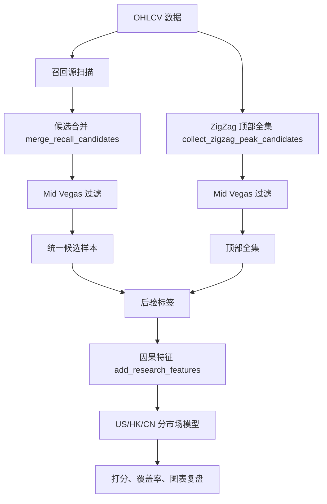

# 顶部识别策略架构

> 截至 2026-06-27。本文档只保留当前架构边界，详细实现与结果见 `docs/top_reversal_current_system.md`。

## 1. 架构原则

当前顶部识别按一条主链路组织：

```text
候选召回源
  -> Mid Vegas 上升趋势入口过滤
  -> 统一候选样本
  -> 后验结构标签
  -> 因果特征
  -> 分市场模型
  -> 覆盖率与复盘
```

核心原则：

- 样本入口由 Mid Vegas 严格上涨趋势决定。
- 主训练任务只有一个：区分 `true_top` 与 `continuation`。
- `ambiguous`、`unconfirmed`、`downtrend_continuation` 保留用于复盘，不进入二分类训练。
- 全局 ZigZag 只用于后验标签和顶部全集，不进入实时特征。
- 所有新增召回源和新增特征都通过模块化接口接入。

## 2. 主流程



## 3. 候选召回层

候选召回只回答一个问题：哪些 K 线值得被模型打分。

当前默认召回源：

| 源 | 实现 | 说明 |
|---|---|---|
| 长上影 | `strategies/impl/top_reversal.py` | 低频蜡烛图顶部候选 |
| 高位跳空十字星 | `strategies/impl/evening_star_gap.py` | 低频蜡烛图顶部候选 |
| SMC 顶部确认 | `candidate_sources.py::collect_smc_top_confirmed_candidates` | 当前主要召回来源 |

SMC 顶部确认内部合并：

- `smc_supply_held`
- `smc_early`
- `smc_confirmed`

可选/诊断召回：

- `smc_raw`
- `smc_appear`
- 独立 `smc_early`
- 独立 `smc_confirmed`
- 未来可接入双顶、头肩顶、前高阻力失败等结构召回源

新增召回源的接入位置：

- 在 `candidate_sources.py` 中实现收集函数。
- 在 `build_top_candidate_research.py::_build_symbol_research_rows` 中加入主召回合并。
- 在 `RECALL_FLAG_DEFAULTS` 和 `recall_flags_for_sources` 中补齐覆盖标记。

## 4. 样本与标签层

训练样本来自两套集合：

| 集合 | 作用 |
|---|---|
| 统一候选样本 | 模型实际会打分的候选 |
| 顶部全集 | 用 ZigZag 高点构建的真顶覆盖评估基准 |

标签逻辑：

- 当前固定使用全局 ZigZag / 大波浪结构做后验标签。
- 全局 ZigZag / 大波浪允许用于后验标签。
- 若后续出现显著更高高点，标为 `continuation`。
- 若候选位于宏观波段顶、或构成确认双顶，标为 `true_top`。
- 近端样本需要摆动级 SMC CHoCH 向下确认，否则为 `unconfirmed`。

实时边界：

- 标签可以使用全局信息，因为它用于训练样本构建。
- 特征必须使用 `score_asof_pos` 当日以前的数据。
- `oracle_*` 字段只用于解释，不进入主模型。

## 5. 特征层

特征由 `feature_registry.py` 显式注册，入口是：

```python
REALTIME_FEATURE_GROUPS
REALTIME_FEATURE_COLS
PRIMARY_MODEL_FEATURE_COLS
```

当前特征组：

| 组 | 说明 |
|---|---|
| `candidate_recall` | 召回源、确认延迟、召回强度 |
| `candle_pattern` | 蜡烛图形态强度 |
| `candle_interaction` | SMC 与蜡烛图共振 |
| `mid_vegas_trend` | 上升趋势入口状态 |
| `price_context` | 涨幅、均线乖离、量能、确认日位置 |
| `technical_exhaustion` | 顶背离、超买、缩量上涨、放量滞涨 |
| `zigzag_anchor` | 因果 ZigZag 锚点与前低 |
| `index_squeeze` | 指数轧空背景 |
| `wave_structure` | 因果大波段结构 |
| `smc_causal` | SMC live/raw/early 可见结构 |
| `prior_high_structure` | 前高、阻力、严格双顶形态 |
| `macro_micro` | 板块和个股 regime |
| `valuation` | 市场内估值分位 |
| `growth` | 因果增长和赛道热度 |

新增特征的接入位置：

- 新建或扩展一个 `*_context.py`。
- 在 `feature_pipeline.py::add_research_features` 中串接。
- 在 `feature_registry.py` 中注册字段。
- 确认该字段是否属于 `REALTIME_FEATURE_GROUPS`。

## 6. 模型层

当前主模型：

| 模型 | 作用 |
|---|---|
| Logistic Regression | 可解释基线，输出系数 |
| LightGBM | 处理非线性和 regime 交互，输出 gain |

默认按市场独立训练：

- US
- HK
- CN

训练只使用：

- `true_top`
- `continuation`

输出统一字段：

- `top_prob`
- score band precision
- 相对顶部全集召回的 recall

## 7. 评估层

评估分三类：

| 评估 | 文件 | 目的 |
|---|---|---|
| 候选标签分布 | `top_candidate_label_summary.md` | 看统一候选的样本构成 |
| 覆盖率 | `recall_coverage_by_true_top.csv` | 看召回源能覆盖多少全集真顶 |
| 模型分数段 | `top_candidate_score_performance.csv` / `top_candidate_lgbm_score_performance.csv` | 看高分段 precision |
| 召回分母评估 | `top_candidate_universe_recall_score_performance.csv` | 以当前召回可触达真顶为分母看 recall |
| 样本外评估 | `three_market_oos_summary.csv` | 分市场 OOS AUC |

## 8. 输出文件规范

当前主输出目录：

```text
data/output/top_candidate_research/
```

主文件：

| 文件 | 内容 |
|---|---|
| `watchlist_unified_recall_candidates_labeled.csv` | 统一候选样本 |
| `watchlist_universe_candidates_labeled.csv` | 顶部全集 |
| `watchlist_pattern_candidates_labeled.csv` | 蜡烛图候选诊断 |
| `watchlist_smc_*_recall_candidates_labeled.csv` | SMC 分层诊断 |
| `recall_coverage_by_true_top.csv` | 召回覆盖率 |
| `universe_true_tops_missed_by_recall.csv` | 漏召回真顶 |
| `top_candidate_logistic_scored.csv` | Logistic 打分 |
| `top_candidate_lgbm_scored.csv` | LightGBM 打分 |
| `top_candidate_*_coefficients.csv` | 模型解释 |
| `top_candidate_*_score_performance.csv` | 分数段表现 |

## 9. 扩展路线

后续新增策略时按两类处理：

| 类型 | 例子 | 接入方式 |
|---|---|---|
| 召回源 | 双顶、头肩顶、前高阻力失败 | 加入 `candidate_sources.py`，再决定是否进入主召回 |
| 特征 | 阻力位密度、板块 beta、成交结构 | 加入 `*_context.py` 和 `feature_registry.py` |

判断是否进入主召回的标准：

- 能显著增加顶部全集真顶覆盖率。
- 不让候选数量失控。
- 召回点能在 2-8 根 K 线内形成可解释确认。

判断是否进入主模型的标准：

- 特征因果可用。
- 在 `true_top` 与 `continuation` 间有稳定区分度。
- 分市场结果不互相抵消。
